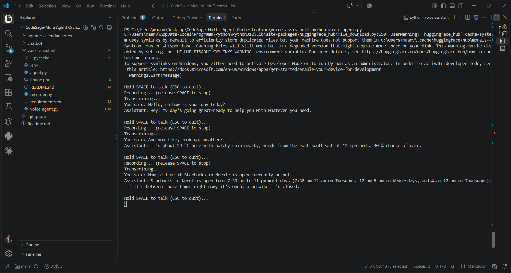
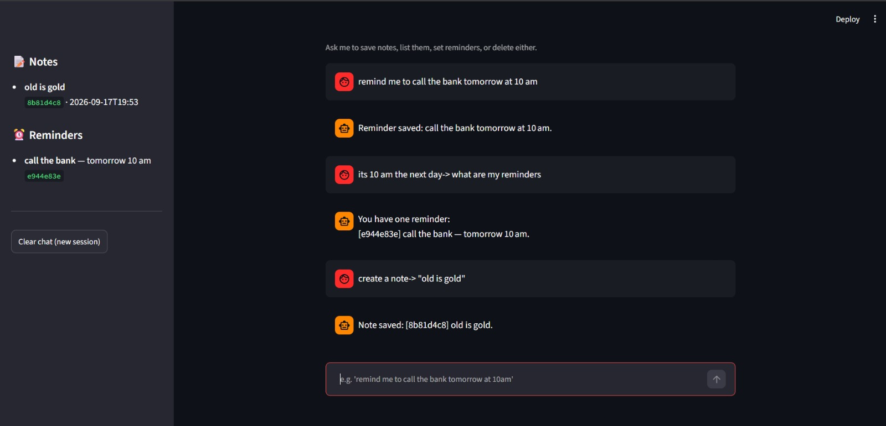
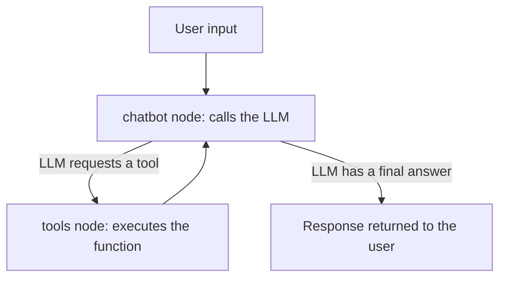

# CodeSage — Multi-Agent Orchestration

A collection of small, self-contained agentic AI projects, each exploring
a different shape of agent built with **LangChain** and **LangGraph** —
from a plain conversational bot up to a hands-free voice assistant that
searches the live web.

Every project uses the same underlying pattern: a **LangGraph** graph
with a chatbot node and a tool node, connected by a conditional edge that
lets the LLM decide, turn by turn, whether it needs to *do* something
before it can answer. The projects differ in what tools they're given and
what interface sits on top.

---

## Projects

### [`voice-assistant/`](./voice-assistant) — Voice Agent
A Siri-style, push-to-talk assistant. Hold a key, ask a question out loud,
and it transcribes your speech locally, searches the web when it needs
current information, and speaks the answer back.



**Stack:** LangGraph · LangChain · Groq · Tavily (web search) · faster-whisper (speech-to-text) · pyttsx3 (text-to-speech)

→ [Full README](./voice-assistant/README.md)

---

### [`chatbot/`](./chatbot) — Notes & Reminders Agent
A Streamlit chat assistant that manages real state — saving, listing, and
deleting notes and reminders through tool calls the LLM decides to make
on its own, with a live sidebar showing what's stored.



**Stack:** LangGraph · LangChain · Groq · Streamlit · JSON-file storage

→ [Full README](./chatbot/README.md)

---

###  [`agentic-calendar-notes/`](./agentic-calendar-notes)
*(Add a short description and screenshot here once this project's README is written.)*

---

##  The shared pattern



- **State** — a `messages` list that accumulates the conversation via LangGraph's `add_messages` reducer.
- **`chatbot` node** — calls the LLM, which has tools bound to it via `llm.bind_tools(...)`.
- **Conditional edge (`tools_condition`)** — checks the model's last message: tool call → route to `tools`; plain answer → route to `END`.
- **`tools` node** — runs whichever tool the LLM asked for and loops back so the model can use the result.
- **`MemorySaver` checkpointer** — persists state per `thread_id`, giving each conversation memory across turns.

This is the same loop behind most production tool-using agents — these
projects just keep the tool sets small (one to six tools) to stay easy to
read end to end.

---

## Getting started

Each project is self-contained with its own `requirements.txt` and `.env`.
See each project's README for exact setup steps, but broadly:

```bash
cd <project-folder>
pip install -r requirements.txt
# add your API key(s) to a .env file — see that project's README for which ones
python <entry_point>.py   # or: streamlit run app.py
```

---

*A set of learning projects exploring agentic workflows with LangChain and LangGraph.*