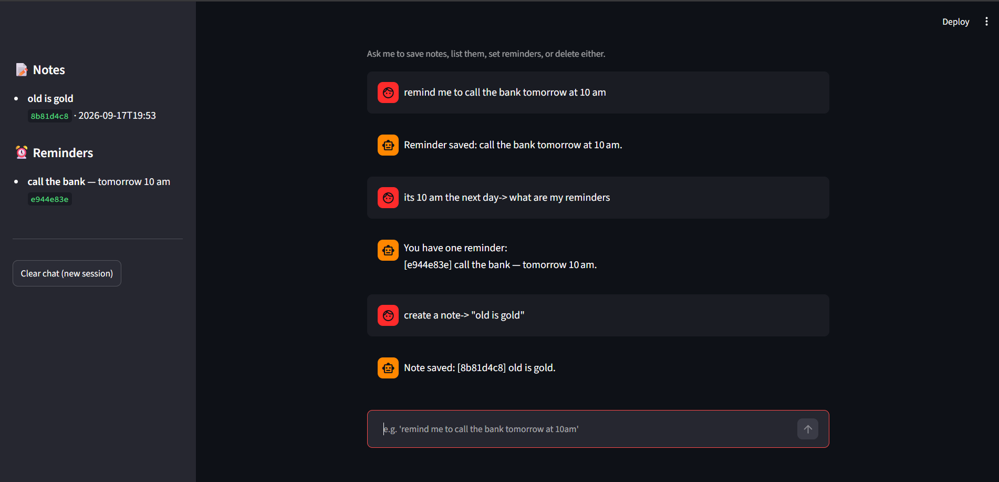
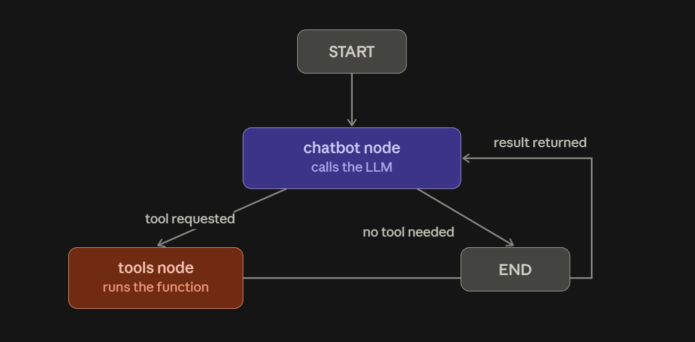

# Personal Assistant Agent (LangChain + LangGraph + Streamlit)

A minimal agentic workflow: a chat assistant that can actually **do things**
(save/list/delete notes and reminders) instead of just talking, with a
Streamlit UI on top.


## Files
- `storage.py` — tiny JSON-file "database" for notes and reminders.
- `tools.py` — LangChain `@tool` wrappers around storage.py. This is what
  the LLM is allowed to call.
- `agent.py` — the LangGraph graph: chatbot node + tool node + conditional
  edges, same loop shape as `chatbot_with_tools.py`.
- `app.py` — Streamlit chat UI, with a sidebar that shows live notes/reminders.
- `.env` — your API key.

## Setup
```bash
pip install -r requirements.txt
```
Put your key in `.env` (same folder), e.g.:
```
GROQ_API_KEY=gsk-your-key-here
```

## Run
```bash
streamlit run app.py
```
This opens a browser tab. Try things like:
- "remind me to call the bank tomorrow at 10am"
- "note that the wifi password is sunflower22"
- "what are my reminders?"
- "delete the wifi note"

## Why this counts as "agentic"
The model isn't just generating text — on every turn it decides whether to
respond directly or call one of six tools, and if it calls `delete_note_tool`
without an id, the system prompt tells it to first call `list_notes_tool`,
read the result, then call delete with the right id. That's a small
multi-step plan the model works out on its own, not something you hardcoded.

## How it's wired (quick recap)
- **State**: `messages`, using the `add_messages` reducer so history
  accumulates turn over turn (see `agent.py`).
- **Nodes**: `chatbot` (calls the LLM) and `tools` (executes whichever tool
  the LLM asked for).
- **Conditional edge**: `tools_condition` checks the model's last message —
  tool call → go to `tools`; plain answer → go to `END`.
- **Memory**: `MemorySaver` + a `thread_id` per browser session (generated
  in `app.py` with `uuid4()`) gives each visitor their own persistent
  conversation without any extra code.
- **Persistence beyond the chat**: notes/reminders live in
  `assistant_data.json` on disk, independent of the conversation memory —
  closing and reopening the app keeps your data, only the chat history resets.

## Natural next steps
- Add a "search notes" tool (keyword match over `storage.list_notes()`).
- Swap `assistant_data.json` for SQLite if you want it more robust.
- Add a real notifications system (e.g. a background job that checks
  reminders due "now") — right now reminders are stored but not triggered.
- Multi-user: key `assistant_data.json` by user id instead of one shared file.
