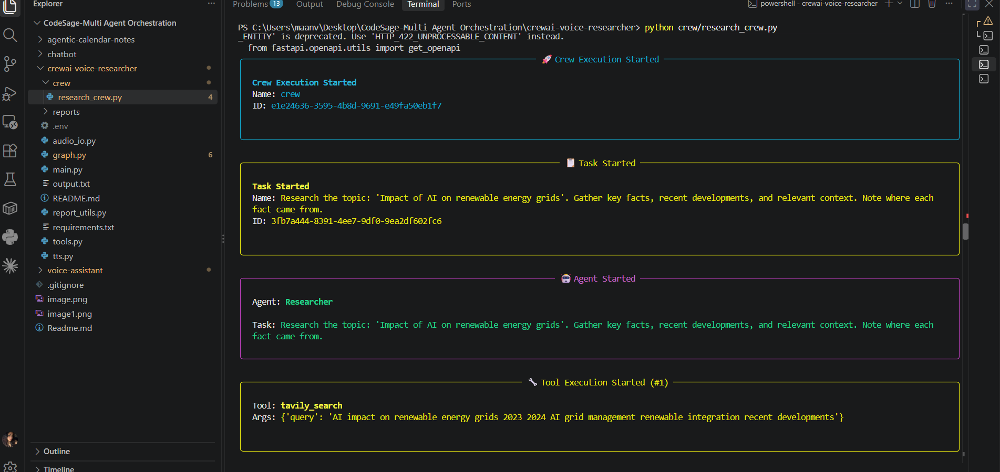

# Voice-Driven Research Reporter

A push-to-talk voice assistant that knows the difference between a quick
question and a real research request.

- **Quick factual question** → answered immediately via a Tavily search
  bound to a single LangGraph agent (same tool-calling loop as the rest of
  [CodeSage](https://github.com/maanvi21/CodeSage)).
- **"Give me a report on X" / "deep dive into Y"** → routed to a **CrewAI**
  crew of three agents (Researcher → Fact-checker → Report Writer) who
  collaborate to produce a structured markdown report, saved under `reports/`.

Either way, you get a short spoken answer back; the full report (when there
is one) lives on disk.

## Architecture

```
                 ┌───────────┐
   mic ──Whisper─▶  router   │   (inspects the transcribed question)
                 └─────┬─────┘
             ┌─────────┴─────────┐
     quick Q │                   │ "report on..."
             ▼                   ▼
        ┌─────────┐        ┌──────────────┐
        │ chatbot │◀──┐    │ crew_research │──▶ CrewAI: Researcher →
        │ (Groq)  │   │    │   (LangGraph  │     Fact-checker → Writer
        └────┬────┘   │    │     node)     │──▶ saved to reports/*.md
             │tool call    └──────────────┘
             ▼         │
        ┌─────────┐    │
        │  tools  │────┘
        │ (Tavily)│
        └─────────┘
             │
             ▼
        spoken answer (pyttsx3)
```

- **LangGraph** owns the conversation state (`MemorySaver` checkpointer, same
  as the other CodeSage projects) and decides, per turn, whether this is a
  one-shot tool call or a job for the crew.
- **CrewAI** only gets invoked for the "heavy" path — it doesn't know or care
  about the voice/graph plumbing around it; `crew/research_crew.py` can be
  run and tested completely standalone.

## Files

| File | Purpose |
|---|---|
| `main.py` | Push-to-talk loop: record → transcribe → run graph → speak |
| `audio_io.py` | Mic recording + local `faster-whisper` transcription |
| `tts.py` | `pyttsx3` speech output (full answer or short summary) |
| `graph.py` | LangGraph `StateGraph`: router → chatbot/tools loop, or → crew_research |
| `tools.py` | Tavily search tool + the "does this need a full report?" heuristic |
| `crew/research_crew.py` | The CrewAI agents, tasks, and crew definition |
| `report_utils.py` | Saves CrewAI reports as timestamped markdown files |
| `reports/` | Output folder for saved reports |

## Setup

```bash
pip install -r requirements.txt
cp .env.example .env   # then fill in GROQ_API_KEY and TAVILY_API_KEY
```

## Try the crew on its own first

Before running the full voice loop, sanity-check the CrewAI layer in
isolation — much easier to debug a bad crew here than inside the graph:

```bash
python crew/research_crew.py
```

## Run it

```bash
python main.py
```

Hold the push-to-talk key (default `right ctrl`, configurable via
`PUSH_TO_TALK_KEY` in `.env`), ask something, release. Try both:

- *"What's the weather like in Tokyo right now?"* → quick Tavily answer
- *"Give me a report on the impact of AI on renewable energy grids"* → CrewAI
  report, saved to `reports/`, with a short spoken summary

## Notes / things to tune

- The routing heuristic in `tools.py::needs_deep_research` is regex + length
  based on purpose — fast and free to run every turn. Swap it for a small
  LLM classification call if you want better accuracy.
- Swap the Whisper model size in `audio_io.py` (`base.en` → `small.en` /
  `medium.en`) for better accuracy if your machine can handle it.
- `crew/research_crew.py` uses `Process.sequential`; try `Process.hierarchical`
  with a manager LLM once you're comfortable with the basics.
