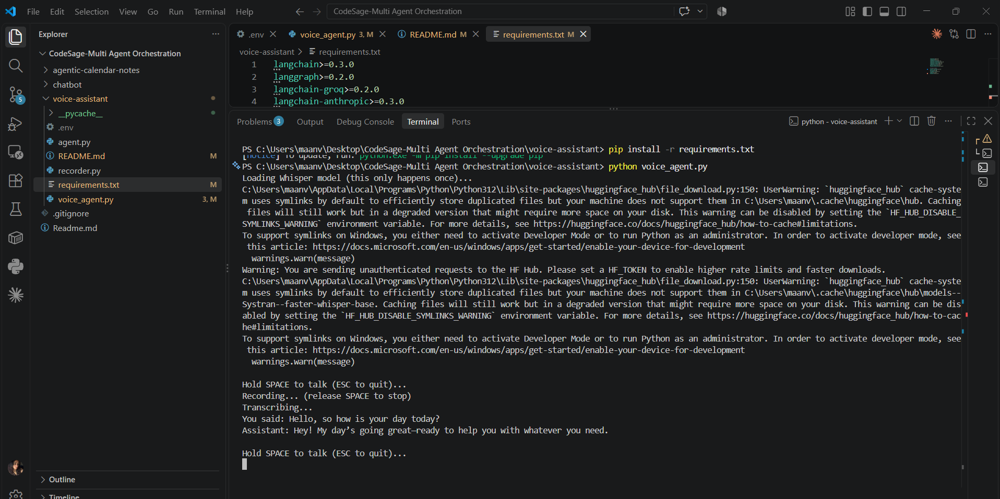

# Voice Agent (LangGraph + Whisper + Tavily + pyttsx3)

A Siri-style push-to-talk assistant: hold SPACE, ask something out loud,
release, and it answers back in speech — searching the web first if the
question needs current information.

## Files
- `recorder.py` — records mic audio while SPACE is held (push-to-talk).
- `agent.py` — the LangGraph agent: chatbot node + `TavilySearch` tool +
  conditional edges, same loop shape as `chatbot_with_tools.py`.
- `voice_agent.py` — wires it together: record → transcribe → run agent →
  speak the reply.
- `.env` — your API keys.

## One-time setup

**1. Install Python dependencies:**
```bash
pip install -r requirements.txt
```
(`faster-whisper` needs no separate ffmpeg install — it decodes audio internally, unlike `openai-whisper`.)

**2. Get a free Tavily key** at tavily.com and put it, plus your Groq key,
in `.env`:
```
GROQ_API_KEY=gsk-your-key-here
TAVILY_API_KEY=tvly-your-key-here
```

**3. On Windows, run your terminal as Administrator** the first time —
the `keyboard` library needs elevated permissions to listen for the
spacebar globally.

## Run
```bash
python voice_agent.py
```
Hold SPACE, ask something like "what's the weather in Mumbai right now"
or "who won the last F1 race", release, and listen for the answer.
Press ESC (instead of holding SPACE) to quit.

## How the pieces connect
1. **`recorder.py`** — `sounddevice` streams raw audio into memory only
   while `keyboard.is_pressed("space")` is true. No wake word, no
   fixed-length recording — you control start/stop directly.
2. **faster-whisper (speech-to-text)** — `WhisperModel("base", device="cpu",
   compute_type="int8")` loads a local model once at startup (no API key,
   runs on your CPU). It's a CTranslate2-based reimplementation of Whisper
   that avoids the `numba`/`torch` dependency chain `openai-whisper` uses,
   which is both faster and sidesteps some Windows driver-signing issues.
   Bigger models (`small`, `medium`) are more accurate but slower — swap
   the string in `voice_agent.py` if accuracy matters more than speed.
3. **The LangGraph agent** — identical shape to `chatbot_with_tools.py`:
   a `chatbot` node calls the LLM, `tools_condition` checks if it asked to
   search the web, `TavilySearch` runs the query and returns results, and
   the loop continues until the model has enough to answer. `MemorySaver`
   keeps conversation history across turns so you can ask follow-ups
   ("what about tomorrow?") without repeating context.
4. **pyttsx3 (text-to-speech)** — converts the final text reply to speech
   locally, using your OS's built-in voices (SAPI5 on Windows, NSSpeechSynthesizer
   on Mac, espeak on Linux). No internet needed, but voice quality is
   noticeably more robotic than a cloud TTS API.

## Trade-offs of the "local, free" choice you made
- **Latency**: Whisper transcription + a Groq/local LLM call + pyttsx3 adds
  up to a few seconds of pause before it speaks — cloud STT/TTS (e.g.
  OpenAI's Realtime API, ElevenLabs) would be faster and sound more
  natural, at the cost of money and an internet dependency for those steps.
- **Accuracy**: faster-whisper's `base` model is fast but occasionally
  mishears; `small` or `medium` trade speed for accuracy.
- **Voice quality**: pyttsx3 sounds like a classic OS text-to-speech voice,
  not a natural human voice. Swapping in ElevenLabs later is a drop-in
  change — same `speak()` function signature, different implementation.

## Natural next steps
- Swap `TavilySearch` for multiple tools (weather API, calendar, etc.) —
  the conditional-edge pattern doesn't change, you just add more tools to
  the list.
- Add a wake word (e.g. with `pvporcupine`) instead of push-to-talk, for
  hands-free use.
- Stream the LLM's response into TTS sentence-by-sentence instead of
  waiting for the full reply, to cut perceived latency.

  